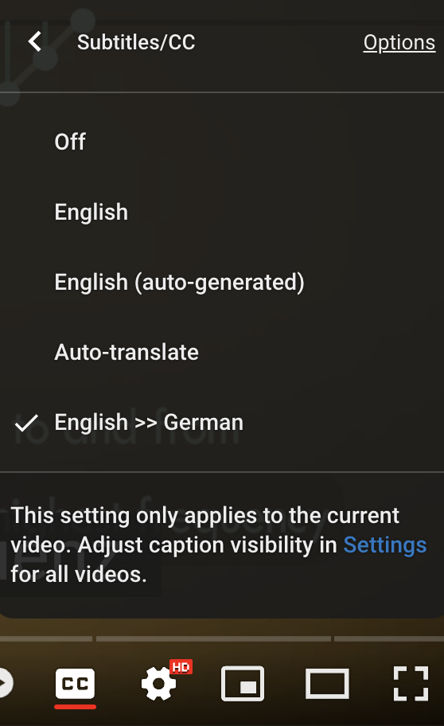

---
# Feel free to add content and custom Front Matter to this file.
# To modify the layout, see https://jekyllrb.com/docs/themes/#overriding-theme-defaults

layout: single   
title: Software + Resources   
lang: us   
ref: res   
permalink: /resources/   
toc: true
toc_label: "Software + Resources" 
toc_icon: "laptop"  
toc_sticky: true   
read_time: true  
show_date: true  
date: 2024-09-30   
date_format: "%Y-%m-%d"  
last_modified_at: 2024-10-09    

---
   
A list of stuff we'll be using throughout the course.    

_Be sure to install + verify these applications before their respective deadlines listed on our Schedule page._   

## Text Editor  

Highlight your code, easily find & replace, and a LOT more... 

_We will be using a text editor for a variety of regular tasks nearly every week in this course. Check your operating system for compatibility. Visual Studio Code is recommended, and we will be demonstrating our in-class examples using it._  

<span style="font-size: smaller; text-transform: uppercase; font-weight: bold;">
	<a href="https://code.visualstudio.com/download/" target="_blank" class="btn btn--primary">Visual Studio Code</a> <a href="https://www.sublimetext.com/" target="_blank" class="btn btn--primary">Sublime Text</a> <a href="https://espressoapp.com/" target="_blank" class="btn btn--primary">Espresso</a> <a href="https://brackets.io/" target="_blank" class="btn btn--primary">Brackets.io</a>
</span>

## Python3 and pip3   

**Python** is an object-oriented, interpreted, and interactive programming language that we’ll be introducing alongside JavaScript.

**pip** is the standard package manager for the Python language, allowing you to easily install code packages and modules from an extensive library. We'll be using a variety of these to faciliate mathematics, machine learning, audio analysis, and visualization. 

mac0S comes bundled with Python 2.7, whereas Windows machines do not have Python installed by default. We will be using **Python3** in this class along with **pip3**, and they may need to be installed separately. Follow the link below to complete these installations, and be sure to choose the most recent versions of Python3 and pip3!    

### Install     

Install **Python3** and **pip3** on your Mac or Windows computer using [Tutorial: How to Install Python on macOS and Windows](https://www.datacamp.com/blog/how-to-install-python?dc_referrer=https%3A%2F%2Fwww.google.com%2F){:target="_blank"}   

You can also use the article [How to install and use Pip3](https://www.activestate.com/resources/quick-reads/how-to-install-and-use-pip3/){:target="_blank"} for additional assistance if necessary.  
  
These installation steps will take some time and will spit out a lot of details on the command line. Keep an eye out for anything that appears as an error message. It's always a good idea to copy the installation log and save it as a text file in case it needs to be reviewed later. Report any such errors to me and include the text you copied, and we'll fix it.  

After each command, wait for your **command prompt** to return to be sure it finished. Your computer's user name will be visible along with the prompt symbol, typically `$` or `%`, and maybe even a fancy blinking cursor...      

```
louisgoldford$ 
```

### Verify  

Open your Terminal and run:

```
python3 --version
```

Your console should return something that looks like this:

```
Python 3.8.5
```

Then, in your Terminal run this:
```
pip3 --version
```

Your console should return something that looks like this:

```
pip 24.0 from /Users/louisgoldford/Library/Python/3.8/lib/python/site-packages/pip (python 3.8)
```

or:

```
pip 18.1 from C:\Python37\lib\site-packages\pip (python 3.7)
```

Let me know if you are returned an error of some sort, or if you are returned an output that substantially differs from what I've listed above.   

### Create a Python3 Alias       

Create an **alias** so that anytime you run the `python` command in a Terminal session, you’ll be using **Python3** instead of an older version. When using Python, run the following command when you begin a Terminal session:  
  
```
alias python=/usr/local/bin/python3  
```
     
## Project Jupyter      

We will also be using the Jupyter univere of computational tools, including Jupyter Notebook and JupyterLab for interactive web-based computational tutorials, and in order to ***arrange workflows in data science, scientific computing, computational journalism, and machine learning.***     

### Install  

Make sure you have **Python3** and **pip3** installed first.  

[Installation instructions can be found here](https://jupyter.org/install.html){:target="_blank"}, but they are also reprinted below using pip3 instead of the older version pip:   

In your Terminal or Terminal Emulator, install **JupyterLab** with pip3 instead of pip:

```
pip3 install jupyterlab   
```

Install the classic **Jupyter Notebook** with pip3 instead of pip:

```
pip3 install notebook
```

Optionally, if you already installed Homebrew (below), you can install JupyterLab this way:

```
brew install jupyterlab
```

All of these steps will take some time and will spit out a lot of details on the command line. Keep an eye out for anything that appears as an error message. It's always a good idea to copy the installation log and save it as a text file in case it needs to be reviewed later. Report any such errors to me and include the text you copied, and we'll fix it.  

After each command, wait for your **command prompt** to return to be sure it finished. Your computer's user name will be visible along with the prompt symbol, typically `$` or `%`, and maybe even a fancy blinking cursor...    

```
louisgoldford$ 
```

### Verify   

Once installed, simply launch **JupyterLab**:   

```
jupyter lab   
```

Or, if this command results in an error, use Python3 to launch JupyterLab instead:   

```   
python3 -m jupyterlab
```  

It should take you to its interface in your web browser. Let me know if you experience any other behavior.   

Also, verify that **Jupyter Notebook** installed properly:   

```
jupyter notebook   
```

or:   

```
python3 -m notebook
```

Like JupyterLab, Jupyter Notebook should also take you to the web browser and open up its own interface. Let me know if you experience any other behavior.    

For further assistance troubleshooting Jupyter-related installation, consult the article [How To Fix "Jupyter: Command Not Found" After Pip Install](https://www.uptimia.com/questions/how-to-fix-jupyter-command-not-found-after-pip-install){:target="_blank"}.    

At any time, exit the Jupyter server  by typing `control Z` to return to your normal Terminal bash command prompt, which should give you something like this:   

```
[3]+  Stopped	python3 -m jupyterlab
louisgoldford$ 
``` 
   
## Julia   

### Install   

Navigate to [Julia Downloads > Current Stable Release](https://julialang.org/downloads/#current_stable_release){:target="_blank"} and select the correct installer for your system. After downloading, unzip or extract the volume and follow any other installation instructions.    

After installation, add Julia to your system's PATH (this step may be done automatically, depending on your OS). For example, on mac0S, open up your **Terminal** and add Julia to your `.bash_profile` or `.zshrc` by running the following command:   

```
export PATH="/Applications/Julia-1.x.app/Contents/Resources/julia/bin:$PATH"  
```

To add Julia to your path on Window using a **Terminal Emulator**, follow the instructions given in the article [Install Julia in 4 Simple Steps](https://julialang.org/downloads/platform/#install_julia_in_4_simple_steps){:target="_blank"}   

### Verify   

After you've taken these steps above, in your Terminal or Terminal Emulator simply run the Julia command. For example:  

```
louisgoldford$ julia
``` 

In response to this command, your Terminal will transform from shell mode to **REPL mode** (***read–eval–print loop***, a simple interactive computer programming environment with its own input prompt `julia>` as you can see below):   

```
               _
   _       _ _(_)_     |  Documentation: https://docs.julialang.org
  (_)     | (_) (_)    |
   _ _   _| |_  __ _   |  Type "?" for help, "]?" for Pkg help.
  | | | | | | |/ _` |  |
  | | |_| | | | (_| |  |  Version 1.10.5 (2024-08-27)
 _/ |\__'_|_|_|\__'_|  |  Official https://julialang.org/ release
|__/                   |

julia> 
```

We will run Julia in the Terminal like this. If you do not see a `julia>` prompt like this, let me know.   

At any time, exit **REPL mode**  by typing `control Z` to return to your normal Terminal bash command prompt, which should give you something like this:   

```
[1]+  Stopped julia
louisgoldford$ 
```
    
## MaxMSP      

_Download + install the current build from:_ <span style="font-size: smaller; text-transform: uppercase; font-weight: bold;"><a href="https://cycling74.com/downloads" target="_blank" class="btn btn--primary">MaxMSP</a></span>

Most recent releases should support our work in class, however. 

At the time of this publication, all software for the class was tested up to Max version 8.5.2 (c9ba072623d) (x64 mac rosetta) on macOS version 12.3 (Build 21E230) x86_64 Rosetta.   

### Temporary Max License Keys   

If you don't have your own, <span style="font-size: smaller; text-transform: uppercase; font-weight: bold;"><a href="mailto:Louis.Goldford@mh-luebeck.de/?subject=[MHL%20Advanced%20CAO]%20Max%20License%20request" target="_blank" class="btn btn--danger">**email me to request a software license key**</a></span>     

We typically have a few licenses available to students enrolled in our courses. 

They are made available on a first-come-first-serve basis. 

If a license key is free, I can make it available to you for the duration of this course and possibly longer, depending on how many other requests I get. Ideally, we would like to ensure you have access to Max for as long as you would need to finish a project.   

## Max Packages + Libraries     

A rolling list of Max packages that we will be using.   
_We may add to this list throughout the semester:_   

<span style="font-size: smaller; text-transform: uppercase; font-weight: bold;">
	1. <a href="https://forum.ircam.fr/projects/detail/modalys/" target="_blank" class="btn btn--primary">modalys~</a> for Physical Modeling (Modal) Synthesis   
	2. <a href="https://cnmat.berkeley.edu/downloads" target="_blank" class="btn btn--primary">CNMAT MaxMSP Externals</a> for resonance modeling          
	3. <a href="https://www.bachproject.net/dl/" target="_blank" class="btn btn--primary">bach</a> for computer-assisted composition   
	4. <a href="https://forum.ircam.fr/projects/detail/spat/" target="_blank" class="btn btn--primary">spat~</a> for multichannel audio spatialization   
	5. <a href="https://github.com/mi-creative/mi-gen" target="_blank" class="btn btn--primary">mi-gen~</a> Mass-Interaction Sound Synthesis Toolbox for Max/MSP's `gen~`         
</span>


### Manual Package Installation   

Of the packages listed above, #1 can be installed directly from the [Max Package Manager](#using-the-max-package-manager) _(see description below)_. 

#2 — #4 must be downloaded directly from their websites linked above and then manually installed. 

Download and decompress each installer and place its unzipped folder into your `Max 8/Packages`. 

This folder is located at:

```
/Users/username/Documents/Max 8
```
_Be sure to replace_ `username` _above with the actual user name on your computer._

#### Register for the IRCAM Forum   

To acquire Max packages #2 and #3 above, you must create a **free** account on the [IRCAM Forum website](https://forum.ircam.fr/){:target="_blank"}.  

Once you register, you'll be able to download `modalys~` and `spat~`.  

These packages are free and will not incure any additional costs.  

### Using the Max Package Manager   

Some packages can be instantly installed through the [Max Package Manager](https://docs.cycling74.com/max7/vignettes/package_manager){:target="_blank"}, such as #1 above, bypassing the need to manually unzip and move any folders into specific locations. 

To begin, in MaxMSP go to `File > Show Package Manager`.   

In the Package Manager window that pops up, type the name of a package, e.g., `miraweb`, in the search bar at the upper-right, and then click the MiraWeb package at the bottom to install:  


On the next page, click the <span style="font-weight: bold; color: lightblue;">blue</span> `Install` button:


When finished, you should see a <span style="font-weight: bold; color: lightblue;">blue</span> `Launch` button and a "Successfully installed Miraweb" message:


From here, you can simply close the Package Manager window.  

Repeat these step to quickly install additional packages.  

_Unfortunately, this method does not work for the IRCAM packages, which must be installed manually from the IRCAM Forum website, as described in [Manual Package Installation](#manual-package-installation) above._  

## Windows: Terminal Emulator   

If your computer runs a Windows operating system, you'll need a program that mimics the behavior of the Unix command line.

<span style="color: red;">_NOTE: macOS + Linux users can ignore this step!_</span>  

Install **one** of these apps:  

<span style="font-size: smaller; text-transform: uppercase; font-weight: bold;">
	<a href="https://gitforwindows.org/" target="_blank" class="btn btn--primary">Git BASH</a> <a href="https://cmder.net/" target="_blank" class="btn btn--primary">Cmder</a> <a href="https://xshell.en.softonic.com/" target="_blank" class="btn btn--primary">Xshell</a> <a href="https://www.puttygen.com/download-putty" target="_blank" class="btn btn--primary">XPuTTY</a>      
</span>

Of these, the first option (Git Bash) has been the most reliable for my previous students.   

Or, check out some alternatives: [15 Best Terminal Emulators for Windows in 2023](https://www.puttygen.com/windows-terminal-emulators){:target="_blank"}  

## macOS + Linux: Homebrew  

A Package management system to ease installation of other tools and software in the Terminal.    

<span style="color: red;">_NOTE: Windows users can ignore this step!_</span>  

### Install     

Open your Terminal and run:  

```
ruby -e "$(curl -fsSL https://raw.github.com/Homebrew/homebrew/go/install)"
```

You may then need to run the following commands to check your installation and update:  

```
brew doctor
```

and 

```
brew update
```

### Verify    

In your Terminal, run this:  

```
brew --version
```

Your console should return a message that looks like this:  

```
Homebrew 2.4.9
```

or

```
Homebrew/homebrew-core (git revision 58437; last commit 2020-08-08)
```

## Version Control with GIT + GitHub   

Git is a very powerful **distributed version control** system for intelligently backing up and tracking changes in your code, or in any set of files.  

It functions alongside **GitHub.com**, which we'll use as a cloud storage platform to keep our files safe, and to submit projects and assignments.   

<span style="color: red;">_NOTE: We installed and used these tools in the previous seminar **Sound Synthesis Techniques**, and we'll continue to use them this semester._</span>  

If you have already taken the time to install these tools, simply **skip this section**. But if you are just joining our class and have not yet worked with these tools, follow the video tutorials below.  

### Register for GitHub.com  

<span style="color: red;">_NOTE: You'll be using GIT (and GitHub.com) to regularly submit class patches and your final projects, so be sure to set this up!_</span>  

Go to [GitHub.com](http://github.com){:target="_blank"} and follow the prompts to set up your **free** account. 

Or visit [this 'How-To' Page for extra support.](https://www.wikihow.com/Create-an-Account-on-GitHub){:target="_blank"}  

#### Verify: Email me!   

Immediately <span style="font-size: smaller; text-transform: uppercase; font-weight: bold;"><a href="mailto:Louis.Goldford@mh-luebeck.de/?subject=[MHL%20Advanced%20CAO]%20GitHub%20user%20name" target="_blank" class="btn btn--danger">**email me your GitHub user name**</a></span> to receive grades in this class!

### GIT Version Control     

To set up GIT on your computer, follow the video tutorial as a quickstart guide:   



Windows Users: install GIT using [Git for Windows](https://gitforwindows.org/){:target="_blank"}  

macOS users: Follow the instructions using Homebrew below...  

#### Install   

Run the following commmand:  

```
brew install git  
```

#### Verify

Run the following commmand:  

```
git --version
```

Your console should return a message that looks like this:   

```
git version 2.20.1 (Apple Git-117)
```

## Additional + Optional Resources   

### Data Sonification Archive   

> *“This curated collection is part of a broader research endeavor in which data, sonification and design converge to explore the potential of sound in complementing other modes of representation and broadening the publics of data. With visualization still being one of the prominent forms of data transformation, we believe that sound can both enrich the experience of data and build new publics.”*  
    
<span style="font-size: smaller; text-transform: uppercase; font-weight: bold;">
	<a href="https://sonification.design/" target="_blank" class="btn btn--primary">Data Sonification Archive</a> 
</span>
   
### Software      

#### Digital Audio Workstations (DAWs)   

<span style="font-size: smaller; text-transform: uppercase; font-weight: bold;">
	<a href="https://www.reaper.fm/download.php/" target="_blank" class="btn btn--primary">Reaper</a> <a href="https://www.ableton.com/en/trial/" target="_blank" class="btn btn--primary">Ableton Live</a>
</span>

#### Audio Analysis Tools   

<span style="font-size: smaller; text-transform: uppercase; font-weight: bold;">
	<a href="https://logiciels.pierrecouprie.fr/" target="_blank" class="btn btn--primary">iAnalyse</a> <a href="https://www.izotope.com/en/rx.html?" target="_blank" class="btn btn--primary">iZotope RX</a> <a href="https://www.klingbeil.com/spear/" target="_blank" class="btn btn--primary">SPEAR</a>
</span>

### Free Sample Libraries    

<span style="font-size: smaller; text-transform: uppercase; font-weight: bold;">
	<a href="https://freesound.org/" target="_blank" class="btn btn--primary">FreeSound.org</a> <a href="https://archive.org/details/nasaaudiocollection" target="_blank" class="btn btn--primary">NASA Audio Collection</a> <a href="https://www.nps.gov/subjects/sound/gallery.htm" target="_blank" class="btn btn--primary">Natural Sounds Gallery</a> <a href="https://theremin.music.uiowa.edu/MIS.html" target="_blank" class="btn btn--primary">Instrumental Samples</a>
</span>

### Tutorials   

<span style="font-size: smaller; text-transform: uppercase; font-weight: bold;">
	<a href="https://einbahnstrasse.github.io/MHL-intro-to-digital-audio/" target="_blank" class="btn btn--primary">Introduction to Digital Audio (Slides)</a> <a href="https://einbahnstrasse.github.io/MHL-intro-to-midi/" target="_blank" class="btn btn--primary">Introduction to MIDI (Slides)</a> <a href="https://einbahnstrasse.github.io/MHL-intro-to-MaxMSP/" target="_blank" class="btn btn--primary">Introduction to MaxMSP (Slides)</a> <a href="https://einbahnstrasse.github.io/MHL-Debugging-in-Max/" target="_blank" class="btn btn--primary">Debugging in MaxMSP (Slides)</a>
</span>   
   
### History + References   

#### Free JavaScript + Python Coding Resources  
   
<span style="font-size: smaller; text-transform: uppercase; font-weight: bold;">
	<a href="https://eloquentjavascript.net/" target="_blank" class="btn btn--primary">Eloquent JavaScript</a> <a href="https://javascript.info/" target="_blank" class="btn btn--primary">The Modern JavaScript Tutorial</a> <a href="https://exploringjs.com/js/book/index.html" target="_blank" class="btn btn--primary">Exploring JavaScript</a> <a href="https://greenteapress.com/thinkstats2/html/index.html" target="_blank" class="btn btn--primary">Think Stats: Exploratory Data Analysis in Python</a> <a href="https://www.py4e.com/book" target="_blank" class="btn btn--primary">Python for Everybody</a> <a href="https://python101.pythonlibrary.org/" target="_blank" class="btn btn--primary">Python 101</a> <a href="http://neuralnetworksanddeeplearning.com/index.html" target="_blank" class="btn btn--primary">Neural Networks and Deep Learning</a>          
</span>
  
#### Audio + Compter Music  

<span style="font-size: smaller; text-transform: uppercase; font-weight: bold;">
	<a href="https://120years.net/" target="_blank" class="btn btn--primary">120 Years Of Electronic Music</a> <a href="https://musicandcomputersbook.com/" target="_blank" class="btn btn--primary">Music and Computers: A Theoretical and Historical Approach</a> <a href="https://msp.ucsd.edu/techniques.htm" target="_blank" class="btn btn--primary">The Theory and Technique of Electronic Music (Miller Puckette)</a> <a href="http://www.pd-tutorial.com/" target="_blank" class="btn btn--primary">Programming Electronic Music in Pd (Johannes Kreidler)</a>    
</span>

#### Sampling Theorem and the Nyquist Frequency    
  

#### Aliasing     
  

_Choose auto-generated German translations of subtitles if it would help:_  


<!--     -->

#### MaxMSP   

<span style="font-size: smaller; text-transform: uppercase; font-weight: bold;">
	<a href="https://music.arts.uci.edu/dobrian/maxcookbook/node/56" target="_blank" class="btn btn--primary">Max Cookbook</a> <a href="https://cycling74.com/forums" target="_blank" class="btn btn--primary">MaxMSP User Forum</a> <a href="https://docs.cycling74.com/max8" target="_blank" class="btn btn--primary">Max 8 Documentation</a> <a href="http://peterelsea.com/maxtutorials.html" target="_blank" class="btn btn--primary">Peter Elsea Tutorials</a> <a href="http://www.maxobjects.com/" target="_blank" class="btn btn--primary">Max Objects Database</a>
</span>


